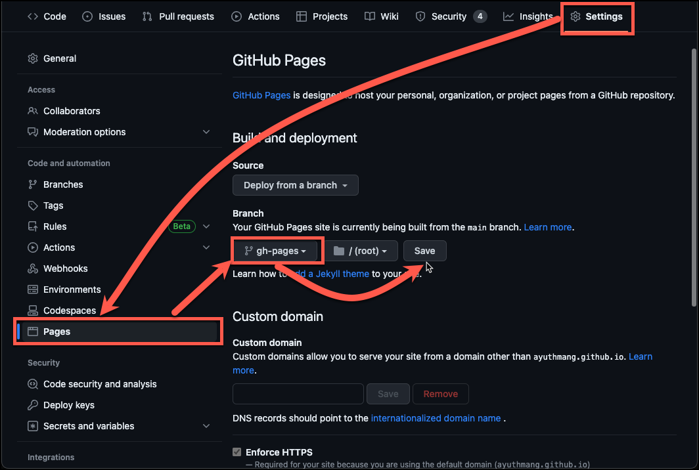

# What's this project all about

This project has pre-configured GitHub workflow and docusaurus which you can fork and bootstrap your docusaurus website with in couple minutes.

## Getting Started

1. Fork this project.
2. Navigate to the project's settings.
3. On the left side, select Pages menu.
   - 
4. On the branch section at the middle of the screen, select "gh-pages" branch and then click the Save button.
   - If the branch doesn't seem to appear, try to edit some file and commit to trigger the Actions to build and push to its branch.

## Change the project's configuration

<!-- In order to -->

## Custom Domain

You can read how to custom domain on your pages at https://docs.github.com/en/pages/configuring-a-custom-domain-for-your-github-pages-site.
